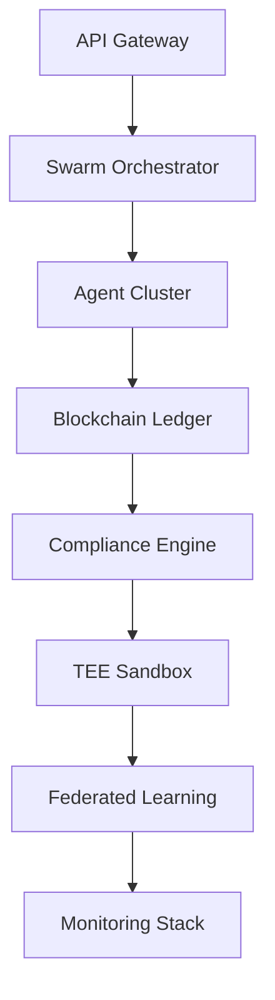
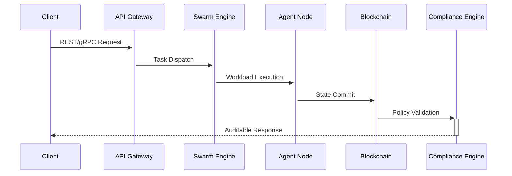
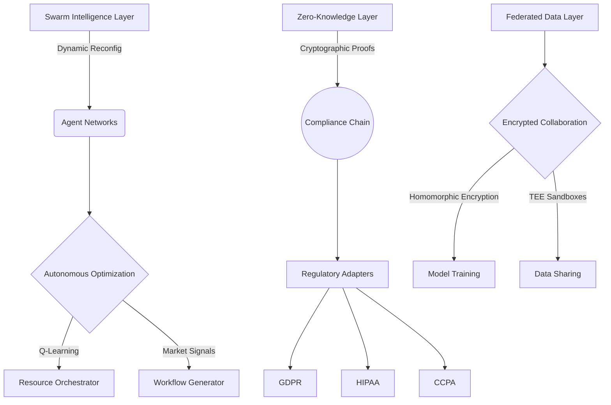

# Orbital AGENT:  The Enterprise-Grade Multi-Agent OS

[](https://opensource.org/licenses/Apache-2.0)
[](https://github.com/orbital-agent/core/actions)
[](https://github.com/orbital-agent/core/releases)
[](https://opensource.org/licenses/Apache-2.0)
[](https://confidentialcomputing.io/)

### Website: https://orbital-agent.com/
### Twitter: https://x.com/OrbitalAGENT / https://x.com/Raj_Agarwnull
### Linkedin: https://www.linkedin.com/in/rajagarw/

**Swarm Intelligence-driven Operating System for Self-Evolving Enterprises**

```text


                                                                                                                                                                                                                                             
                                      bbbbbbbb                                                                                                                                                                                               
     OOOOOOOOO                        b::::::b              iiii          tttt                            lllllll                     AAA                  GGGGGGGGGGGGGEEEEEEEEEEEEEEEEEEEEEENNNNNNNN        NNNNNNNNTTTTTTTTTTTTTTTTTTTTTTT
   OO:::::::::OO                      b::::::b             i::::i      ttt:::t                            l:::::l                    A:::A              GGG::::::::::::GE::::::::::::::::::::EN:::::::N       N::::::NT:::::::::::::::::::::T
 OO:::::::::::::OO                    b::::::b              iiii       t:::::t                            l:::::l                   A:::::A           GG:::::::::::::::GE::::::::::::::::::::EN::::::::N      N::::::NT:::::::::::::::::::::T
O:::::::OOO:::::::O                    b:::::b                         t:::::t                            l:::::l                  A:::::::A         G:::::GGGGGGGG::::GEE::::::EEEEEEEEE::::EN:::::::::N     N::::::NT:::::TT:::::::TT:::::T
O::::::O   O::::::Orrrrr   rrrrrrrrr   b:::::bbbbbbbbb    iiiiiiittttttt:::::ttttttt      aaaaaaaaaaaaa    l::::l                 A:::::::::A       G:::::G       GGGGGG  E:::::E       EEEEEEN::::::::::N    N::::::NTTTTTT  T:::::T  TTTTTT
O:::::O     O:::::Or::::rrr:::::::::r  b::::::::::::::bb  i:::::it:::::::::::::::::t      a::::::::::::a   l::::l                A:::::A:::::A     G:::::G                E:::::E             N:::::::::::N   N::::::N        T:::::T        
O:::::O     O:::::Or:::::::::::::::::r b::::::::::::::::b  i::::it:::::::::::::::::t      aaaaaaaaa:::::a  l::::l               A:::::A A:::::A    G:::::G                E::::::EEEEEEEEEE   N:::::::N::::N  N::::::N        T:::::T        
O:::::O     O:::::Orr::::::rrrrr::::::rb:::::bbbbb:::::::b i::::itttttt:::::::tttttt               a::::a  l::::l              A:::::A   A:::::A   G:::::G    GGGGGGGGGG  E:::::::::::::::E   N::::::N N::::N N::::::N        T:::::T        
O:::::O     O:::::O r:::::r     r:::::rb:::::b    b::::::b i::::i      t:::::t              aaaaaaa:::::a  l::::l             A:::::A     A:::::A  G:::::G    G::::::::G  E:::::::::::::::E   N::::::N  N::::N:::::::N        T:::::T        
O:::::O     O:::::O r:::::r     rrrrrrrb:::::b     b:::::b i::::i      t:::::t            aa::::::::::::a  l::::l            A:::::AAAAAAAAA:::::A G:::::G    GGGGG::::G  E::::::EEEEEEEEEE   N::::::N   N:::::::::::N        T:::::T        
O:::::O     O:::::O r:::::r            b:::::b     b:::::b i::::i      t:::::t           a::::aaaa::::::a  l::::l           A:::::::::::::::::::::AG:::::G        G::::G  E:::::E             N::::::N    N::::::::::N        T:::::T        
O::::::O   O::::::O r:::::r            b:::::b     b:::::b i::::i      t:::::t    tttttta::::a    a:::::a  l::::l          A:::::AAAAAAAAAAAAA:::::AG:::::G       G::::G  E:::::E       EEEEEEN::::::N     N:::::::::N        T:::::T        
O:::::::OOO:::::::O r:::::r            b:::::bbbbbb::::::bi::::::i     t::::::tttt:::::ta::::a    a:::::a l::::::l        A:::::A             A:::::AG:::::GGGGGGGG::::GEE::::::EEEEEEEE:::::EN::::::N      N::::::::N      TT:::::::TT      
 OO:::::::::::::OO  r:::::r            b::::::::::::::::b i::::::i     tt::::::::::::::ta:::::aaaa::::::a l::::::l       A:::::A               A:::::AGG:::::::::::::::GE::::::::::::::::::::EN::::::N       N:::::::N      T:::::::::T      
   OO:::::::::OO    r:::::r            b:::::::::::::::b  i::::::i       tt:::::::::::tt a::::::::::aa:::al::::::l      A:::::A                 A:::::A GGG::::::GGG:::GE::::::::::::::::::::EN::::::N        N::::::N      T:::::::::T      
     OOOOOOOOO      rrrrrrr            bbbbbbbbbbbbbbbb   iiiiiiii         ttttttttttt    aaaaaaaaaa  aaaallllllll     AAAAAAA                   AAAAAAA   GGGGGG   GGGGEEEEEEEEEEEEEEEEEEEEEENNNNNNNN         NNNNNNN      TTTTTTTTTTT      
                                                                                                                                                                                                                                                                                                                                                                                                                                                                                   
```                                                                                                                                                                                                                                      

## Table of Contents
- [Architecture Overview](#architecture-overview)
- [Key Features](#key-features)
- [Technology Stack](#technology-stack)
- [Quick Start](#quick-start)
- [Configuration](#configuration)
- [Deployment Options](#deployment-options)
- [Contributing](#contributing)
- [License](#license)

## Architecture Overview

### Core Components


### Data Flow


## 🚀 Core Capabilities

### 1. Dynamic Agent Networks
```
# Real-time swarm orchestration example
from orbital.agent_management import SwarmOrchestrator

swarm = SwarmOrchestrator()
swarm.register_agent(agent_id="logistics_01", resource_profile={"cpu": 4, "mem": "16GB"})
optimal_agents = swarm.optimize(task_matrix=emergency_supply_chain_scenario)
```

### 2. Zero-Knowledge Compliance
```
# GDPR audit proof generation
from orbital.compliance import ZKPEngine

zkp = ZKPEngine(circuit="gdpr_v1")
audit_proof = zkp.generate_proof(
    public_data=transaction_metadata,
    private_data=user_pii
)
```

### 3. Federated Enterprise Learning
```
# Cross-company model training
from orbital.federated import SecureTrainer

trainer = SecureTrainer(tee_enclave="sgx_v2")
model = trainer.collaborative_fit(
    participants=[hospital_a, hospital_b],
    model=patient_readmission_predictor
)
```

## 🧠 Architecture Overview


## 🛠️ Installation

### Prerequisites
- Intel SGX-enabled hardware (DCAP drivers installed)
- Python 3.8+ with virtualenv
- Docker 20.10+ & Kubernetes 1.23+
- Hyperledger Fabric 2.4

## 📈 Enterprise Deployment

### Production Architecture

                          +-------------------+
                          |  Cloud Provider   |
                          | (AWS/Azure/GCP)   |
                          +-------------------+
                                   |
                                   | TLS 1.3
                          +-------------------+
                          |  Control Plane    |
                          |  - Swarm Manager  |
                          |  - ZKP Verifier   |
                          +-------------------+
                                   |
                          +-------------------+
                          |  Confidential    |
                          |  Compute Nodes    |
                          |  (SGX/TEE)        |
                          +-------------------+
                                   |
                          +-------------------+
                          |  Edge Gateways    |
                          |  - Legacy Adapters|
                          +-------------------+
                          
                          ```

## Performance Benchmarks

| Scenario | Metric | Result |
|----------|----------|----------|
| Supply Chain Disruption | Agent Reconfiguration Time | 8.2 ±1.3 sec |
| Cross-Border Compliance | ZKP Proof Generation | 47 ms |
| Federated Model Training | 100GB Data Throughput | 12.4 GB/s |

## 🤝 Contributing

### Development Workflow

```
# 1. Create feature branch
git checkout -b feat/autoscaling-v2

# 2. Run test suite
pytest tests/ --cov=src -v

# 3. Submit PR with:
# - Architecture diagram updates
# - Threat model analysis
# - Performance benchmark comparisons
```

## 📜 License
Apache 2.0 - See LICENSE for details.

